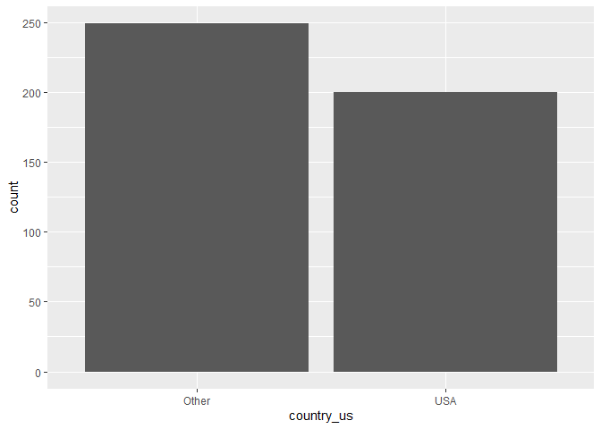
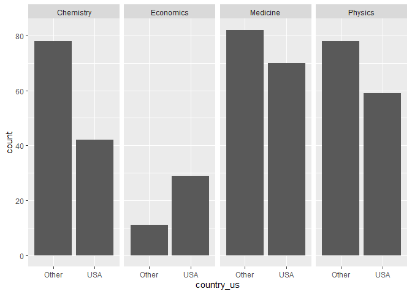
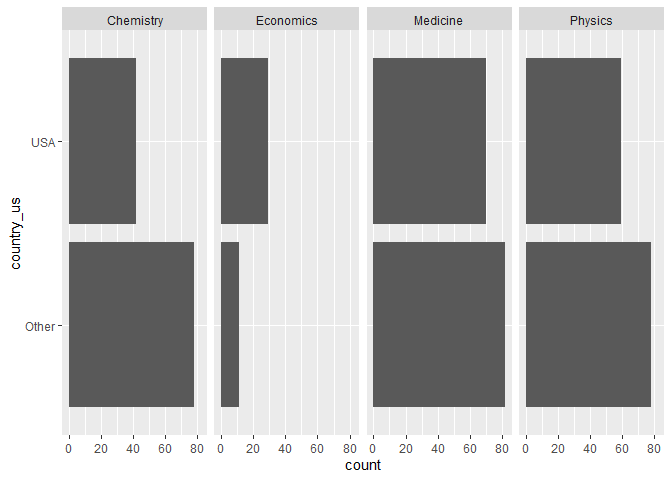
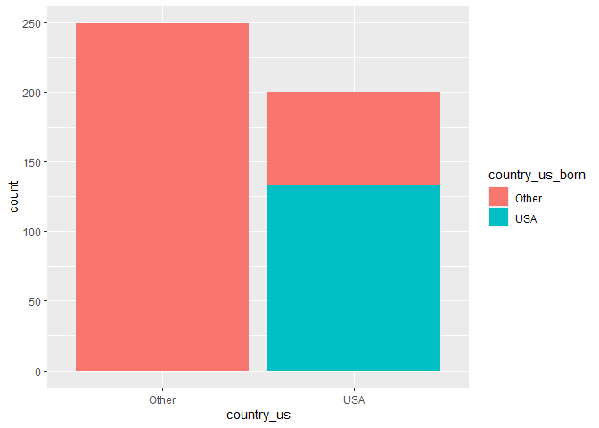
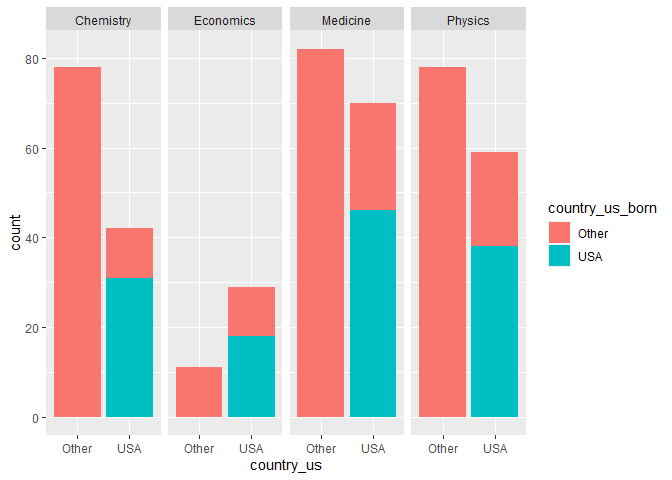

Lab 03 - Nobel laureates
================
Eric Stone
1.16.24

### Load packages and data

``` r
library(tidyverse) 
```

``` r
nobel <- read_csv("data/nobel.csv")
```

## Exercises

### Exercise 1

``` r
number_of_rows <- nrow(nobel)
number_of_columns <- ncol(nobel)
print(paste("Number of rows:", number_of_rows))
```

    ## [1] "Number of rows: 935"

``` r
print(paste("Number of columns:", number_of_columns))
```

    ## [1] "Number of columns: 26"

How many observations and how many variables are in the dataset? Use
inline code to answer this question. What does each row represent?

There are 935 observations and 26 variables. Note that I could also just
see this in the environment, but this code produced the information as
well.

### Exercise 2

``` r
# making sure the simplest command works
nobel %>%
  count (country)
```

    ## # A tibble: 28 × 2
    ##    country            n
    ##    <chr>          <int>
    ##  1 Argentina          2
    ##  2 Australia          4
    ##  3 Austria            6
    ##  4 Belgium            5
    ##  5 Canada             8
    ##  6 China              1
    ##  7 Czech Republic     1
    ##  8 Denmark            8
    ##  9 Finland            1
    ## 10 France            38
    ## # ℹ 18 more rows

``` r
# seeing if I am filtering for na appropriately
nobel_subset <- nobel %>%
  filter(!is.na(country))
nobel_subset %>%
  count (country)
```

    ## # A tibble: 27 × 2
    ##    country            n
    ##    <chr>          <int>
    ##  1 Argentina          2
    ##  2 Australia          4
    ##  3 Austria            6
    ##  4 Belgium            5
    ##  5 Canada             8
    ##  6 China              1
    ##  7 Czech Republic     1
    ##  8 Denmark            8
    ##  9 Finland            1
    ## 10 France            38
    ## # ℹ 17 more rows

``` r
# now filtering for people
nobel %>%
  count (gender)
```

    ## # A tibble: 3 × 2
    ##   gender     n
    ##   <chr>  <int>
    ## 1 female    52
    ## 2 male     856
    ## 3 org       27

``` r
nobel_subset2 <- nobel %>%
  filter(gender != "org")
nobel_subset2 %>%
  count (gender)
```

    ## # A tibble: 2 × 2
    ##   gender     n
    ##   <chr>  <int>
    ## 1 female    52
    ## 2 male     856

``` r
# now filtering for alive people
nobel_subset3 <- nobel %>%
  filter(!is.na(died_date))
nobel_subset3 %>%
  count (died_date)
```

    ## # A tibble: 616 × 2
    ##    died_date      n
    ##    <date>     <int>
    ##  1 1903-11-01     1
    ##  2 1904-09-24     1
    ##  3 1906-04-19     1
    ##  4 1906-12-07     1
    ##  5 1907-02-16     1
    ##  6 1907-02-20     1
    ##  7 1907-09-07     1
    ##  8 1908-07-22     1
    ##  9 1908-08-25     1
    ## 10 1910-04-26     1
    ## # ℹ 606 more rows

``` r
# now putting it all together
nobel_living <- nobel %>%
  filter (
    !is.na(country),
    gender != "org" ,
    !is.na(died_date)
  )
number_of_rows <- nrow(nobel_living)
number_of_columns <- ncol(nobel_living)
print(paste("Number of rows:", number_of_rows))
```

    ## [1] "Number of rows: 453"

``` r
print(paste("Number of columns:", number_of_columns))
```

    ## [1] "Number of columns: 26"

``` r
# I have 453 observations, so something is wrong.
nobel_living %>%
  count (country)
```

    ## # A tibble: 25 × 2
    ##    country            n
    ##    <chr>          <int>
    ##  1 Argentina          2
    ##  2 Australia          2
    ##  3 Austria            6
    ##  4 Belgium            4
    ##  5 Canada             5
    ##  6 Czech Republic     1
    ##  7 Denmark            7
    ##  8 Finland            1
    ##  9 France            27
    ## 10 Germany           55
    ## # ℹ 15 more rows

``` r
nobel_living %>%
  count (gender)
```

    ## # A tibble: 2 × 2
    ##   gender     n
    ##   <chr>  <int>
    ## 1 female    10
    ## 2 male     443

``` r
nobel_living %>%
  count (died_date)
```

    ## # A tibble: 444 × 2
    ##    died_date      n
    ##    <date>     <int>
    ##  1 1904-09-24     1
    ##  2 1906-04-19     1
    ##  3 1907-02-20     1
    ##  4 1908-08-25     1
    ##  5 1910-05-27     1
    ##  6 1911-03-01     1
    ##  7 1915-08-20     1
    ##  8 1916-07-15     1
    ##  9 1916-07-23     1
    ## 10 1917-03-31     1
    ## # ℹ 434 more rows

Create a new data frame called nobel_living that filters for

laureates for whom country is available laureates who are people as
opposed to organizations (organizations are denoted with “org” as their
gender) laureates who are still alive (their died_date is NA)

Confirm that once you have filtered for these characteristics you are
left with a data frame with 228 observations, once again using inline
code.

Hmm. I have 453 observations. :(

However … when I check, I have no na’s for country, no org in gender,
and no na’s for died_date. I’ve also looked through the data set, and
that confirms the above. I think my 453 is correct, but I realize I may
be wrong!

### Exercise 3

``` r
# creating nobel_living_science with the variable depicting US yes/no
nobel_living_science <- nobel_living %>%
  filter(category %in% c("Physics", "Medicine", "Chemistry", "Economics"))
nobel_living_science <- nobel_living_science %>%
  mutate(
    country_us = if_else(country == "USA", "USA", "Other")
  )
nobel_living_science %>%
  count (country_us)
```

    ## # A tibble: 2 × 2
    ##   country_us     n
    ##   <chr>      <int>
    ## 1 Other        249
    ## 2 USA          200

``` r
# simple bar chart, ignoring category .
ggplot(data = nobel_living_science, mapping = aes(x = country_us)) +
  geom_bar()
```

<!-- -->

``` r
ggplot(nobel_living_science, aes (x = country_us)) +
  geom_bar()
```

<!-- -->

``` r
#faceting by category .
ggplot(nobel_living_science, aes (x = country_us)) +
  geom_bar() +
  facet_grid (~ category)
```

<!-- -->

``` r
# and now switching axes .
ggplot(nobel_living_science, aes (x = country_us)) +
  geom_bar() +
  facet_grid (~ category) +
  coord_flip()
```

<!-- -->

Create a faceted bar plot visualizing the relationship between the
category of prize and whether the laureate was in the US when they won
the nobel prize. Interpret your visualization, and say a few words about
whether the Buzzfeed headline is supported by the data.

These data aren’t all that relevant to the Buzzfeed claim, because they
don’t delve into where the person was born. With that said, it is
interesting that there seems to be some variation with discipline. In
chemistry, there is a smaller percentage of winners who live in the US.

### Exercise 4

``` r
nobel_living_science <- nobel_living_science %>%
  mutate(
    country_us_born = if_else(born_country == "USA", "USA", "Other")
  )
nobel_living_science %>%
  count (country_us_born)
```

    ## # A tibble: 2 × 2
    ##   country_us_born     n
    ##   <chr>           <int>
    ## 1 Other             316
    ## 2 USA               133

Create a new variable called born_country_us that has the value “USA” if
the laureate is born in the US, and “Other” otherwise. How many of the
winners are born in the US?

133 were born in the US. 316 were born elsewhere. This is a
substantially smaller percentage than the percentage that were living in
the US when they won the prize.

### Exercise 5

Add a second variable to your visualization from Exercise 3 based on
whether the laureate was born in the US or not. Based on your
visualization, do the data appear to support Buzzfeed’s claim? Explain
your reasoning in 1-2 sentences.

    Your final visualization should contain a facet for each category.
    Within each facet, there should be a bar for whether the laureate won the award in the US or not.
    Each bar should have segments for whether the laureate was born in the US or not.

``` r
#starting without the faceting .
ggplot(data = nobel_living_science, mapping = aes(x = country_us, 
                  fill = country_us_born))+
  geom_bar()
```

<!-- -->

``` r
#now faceting .
ggplot(data = nobel_living_science, mapping = aes(x = country_us, 
                  fill = country_us_born))+
  geom_bar() +
  facet_grid (~ category)
```

<!-- --> Answer: Regardless
of the category, a sizeable minority of the US-born winners were born in
other countries, whereas none of the non-US-born winners were born in
the United States.

### Exercise 6

In a single pipeline, filter for laureates who won their prize in the
US, but were born outside of the US, and then create a frequency table
(with the count() function) for their birth country (born_country) and
arrange the resulting data frame in descending order of number of
observations for each country. Which country is the most common?

``` r
#assuming we're still working with living laureates in the sciences
nobel_living_science_finalfilter <- nobel_living_science %>%
  filter (
    country_us == "USA" ,
    country_us_born == "Other"
  )
nobel_living_science_finalfilter %>%
  count (born_country) %>%
  arrange(desc(n))
```

    ## # A tibble: 27 × 2
    ##    born_country       n
    ##    <chr>          <int>
    ##  1 Canada             8
    ##  2 United Kingdom     8
    ##  3 Poland             6
    ##  4 France             4
    ##  5 Hungary            4
    ##  6 Italy              4
    ##  7 Russia             4
    ##  8 Austria            3
    ##  9 Germany            3
    ## 10 South Africa       3
    ## # ℹ 17 more rows

Canada and the United Kingdom are the most common!
